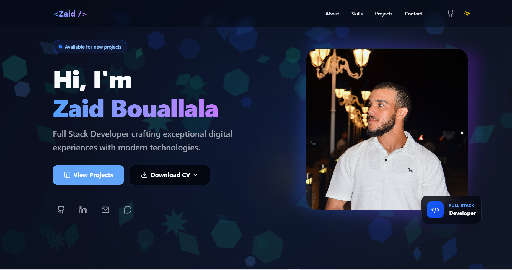
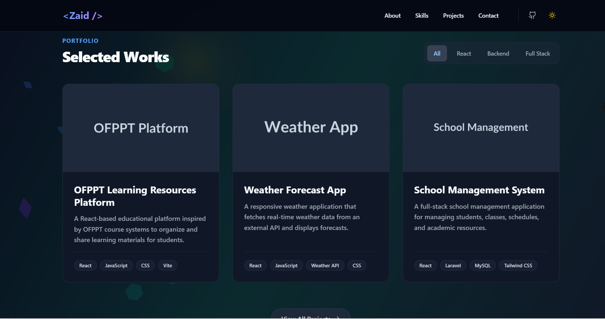

# Personal Portfolio – Full Stack Web Developer
**By Zaid Bouallala**

Built with React, TypeScript, Tailwind CSS & Vite


A high-performance, responsive, and interactive personal portfolio website built with the modern React ecosystem. This project showcases professional experience, technical skills, and creative projects with a focus on clean code, accessibility, and premium UI/UX.

## 🔗 Live Demo

**[View Live Portfolio](https://zaidbouallala.vercel.app/)**

<p align="center">
  
  <br>
  <em>Portfolio Homepage Design</em>
</p>

<p align="center">
  
  <br>
  <em>Projects Section</em>
</p>

##  Features

- **Modern Tech Stack**: Built with React 19, TypeScript, and Vite for blazing fast performance.
- **Responsive Design**: Mobile-first architecture ensures a perfect experience across all devices.
- **Dark Mode Support**: System-aware theme switching with persistent user preference.
- **Interactive UI**: Smooth animations using Framer Motion and custom CSS transitions.
- **Accessibility (a11y)**: Semantic HTML and ARIA labels for screen reader support.
- **High Performance**: Optimized assets, lazy loading, and code splitting.

##  Tech Stack

- **Framework**: [React](https://react.dev/)
- **Language**: [TypeScript](https://www.typescriptlang.org/)
- **Build Tool**: [Vite](https://vitejs.dev/)
- **Styling**: [Tailwind CSS v4](https://tailwindcss.com/)
- **Icons**: [Lucide React](https://lucide.dev/)
- **Animations**: [Framer Motion](https://www.framer.com/motion/)

##  Project Structure

```bash
src/
├── components/      # Reusable UI components (Hero, About, Projects, etc.)
├── data/           # Static content (projects, skills, config) separation
├── hooks/          # Custom React hooks
├── types/          # TypeScript definitions
├── App.tsx         # Main application entry
└── index.css       # Global styles and Tailwind configuration
```

##  Getting Started

### Prerequisites

- Node.js (v18 or higher recommended)
- npm, yarn, or pnpm

### Installation

1. **Clone the repository**

    ```bash
    git clone https://github.com/yourusername/myPortfolio.git
    cd myPortfolio
    ```

2. **Install dependencies**

    ```bash
    npm install
    # or
    yarn install
    ```

3. **Start the Development Server**

    ```bash
    npm run dev
    ```

    Open [http://localhost:5173](http://localhost:5173) (or the port shown in your terminal) to view the app.


##  License

This project is licensed under the MIT License - see the LICENSE file for details.

---

*Designed and developed with ❤️.*
